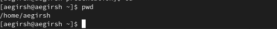
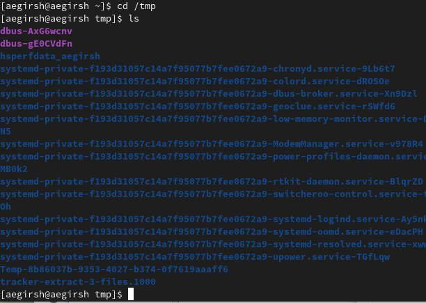
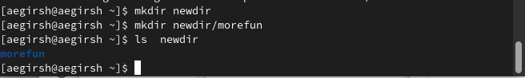
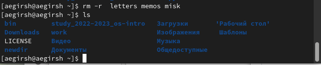

---
## Front matter
lang: ru-RU
title: Презентация отчета по лабораторной номер 4
author:
  - Гиршфельд А. Е.
institute:
  - Российский университет дружбы народов, Москва, Россия

## i18n babel
babel-lang: russian
babel-otherlangs: english

## Formatting pdf
toc: false
toc-title: Содержание
slide_level: 2
aspectratio: 169
section-titles: true
theme: metropolis
header-includes:
 - \metroset{progressbar=frametitle,sectionpage=progressbar,numbering=fraction}
 - '\makeatletter'
 - '\beamer@ignorenonframefalse'
 - '\makeatother'
---

## Цели и задачи

Приобретение практических навыков взаимодействия пользователя с системой по-
средством командной строки.

## команда pwd

{#fig:001 width=70%}

## команда ls

{#fig:002 width=70%}

## команда mkdir

{#fig:006 width=70%}

## команда rm

{#fig:008 width=70%}

## Результаты

Приобрел практические навыки взаимодействия пользователя с системой по-
средством командной строки.

