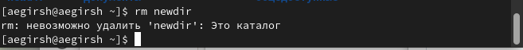
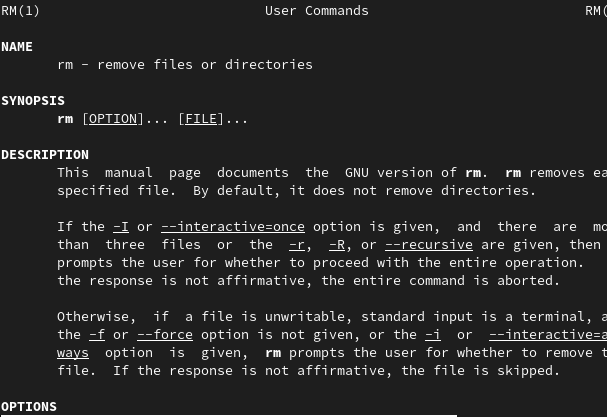
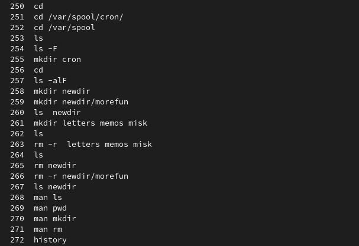

---
## Front matter
title: "Отчёт по лабораторной работе №6"
author: "Гиршфельд Александр"

## Generic otions
lang: ru-RU
toc-title: "Содержание"

## Bibliography
bibliography: bib/cite.bib
csl: pandoc/csl/gost-r-7-0-5-2008-numeric.csl

## Pdf output format
toc: true # Table of contents
toc-depth: 2
lof: true # List of figures
lot: true # List of tables
fontsize: 12pt
linestretch: 1.5
papersize: a4
documentclass: scrreprt
## I18n polyglossia
polyglossia-lang:
  name: russian
  options:
	- spelling=modern
	- babelshorthands=true
polyglossia-otherlangs:
  name: english
## I18n babel
babel-lang: russian
babel-otherlangs: english
## Fonts
mainfont: PT Serif
romanfont: PT Serif
sansfont: PT Sans
monofont: PT Mono
mainfontoptions: Ligatures=TeX
romanfontoptions: Ligatures=TeX
sansfontoptions: Ligatures=TeX,Scale=MatchLowercase
monofontoptions: Scale=MatchLowercase,Scale=0.9
## Biblatex
biblatex: true
biblio-style: "gost-numeric"
biblatexoptions:
  - parentracker=true
  - backend=biber
  - hyperref=auto
  - language=auto
  - autolang=other*
  - citestyle=gost-numeric
## Pandoc-crossref LaTeX customization
figureTitle: "Рис."
tableTitle: "Таблица"
listingTitle: "Листинг"
lofTitle: "Список иллюстраций"
lotTitle: "Список таблиц"
lolTitle: "Листинги"
## Misc options
indent: true
header-includes:
  - \usepackage{indentfirst}
  - \usepackage{float} # keep figures where there are in the text
  - \floatplacement{figure}{H} # keep figures where there are in the text
---

# Цель работы

Приобретение практических навыков взаимодействия пользователя с системой по-
средством командной строки.

# Выполнение лабораторной работы

Определил с помощью команды pwd путь до домашнего каталога.(рис. @fig:001).

{#fig:001 width=70%}

Перешел в католог tmp с помощью команды cd и вывел его содержиое с помощью ls.(рис. @fig:002).

{#fig:002 width=70%}

Посмотрел на содержимое tmp с помощью ls с другим флагом -а(рис. @fig:003).

{#fig:003 width=70%}

Узнал есть ли папка(рис. @fig:004).

{#fig:004 width=70%}

Вывел содержимое домашнего каталога (рис. @fig:005).

{#fig:005 width=70%}

Создал в домашнем катологе новую папку, внутри нее еще одну, проверил, что внутренняя создалась.(рис. @fig:006).

{#fig:006 width=70%}

Создал несколько папок( одной командойрис. @fig:007).

{#fig:007 width=70%}

Удалил их одной командой(рис. @fig:008).

{#fig:008 width=70%}

Попробовал удалить папку комнадой rm без использования флагов.(рис. @fig:009)

{#fig:009 width=70%}

Удалил каталог вместе с его подкатлогом(рис. @fig:010).

{#fig:010 width=70%}

С помощью команды man рассмотрел флаги команды ls.
Например, для рекурсивного вывода подкаталогов можно использовать флаг 
-R(рис. @fig:011)

{#fig:011 width=70%}

Чтобы вывести файлы в порядке их создания, можно использовать флаг -t(рис. @fig:012)

{#fig:012 width=70%}

Флаг -Z выводит более подробную информацию об файлах(рис. @fig:013)

{#fig:013 width=70%}

man pwd (рис. @fig:014)

{#fig:014 width=70%}

man mkdir флаги(рис. @fig:015)

{#fig:015 width=70%}

man rm (рис. @fig:016)

{#fig:016 width=70%}

Ввел history(рис. @fig:017)

{#fig:017 width=70%}

# Выводы

Приобрел практические навыки взаимодействия пользователя с системой по-
средством командной строки.

# Ответы на    контрольные вопросы

1. Командная строка - это текстовая система, которая передает команды компьютеру и возвращает результаты пользователю.
2. Для определения абсолютного пути к текущему каталогу используется команда pwd. Например: если я введу
pwd в своем домашнем каталоге то получу /home/aegirsh
3. С помощью команды ls можно определить имена файлов, при помощи опции -F уже мы сможем определить тип файлов, если нам необходимы скрытые файлы, добавим опцию -a. Пример есть в лабораторной работе.
4. С помощью команды ls можно определить имена файлов, если нам необходимы скрытые файлы, добавим опцию -a. Пример есть в лабораторной работе.
5. rmdir по умолчанию удаляет пустые каталоги, не удаляет файлы. rm удаляет файлы, без дополнительных опций (-d, -r) не будет удалять каталоги. Удалить в одной строчке одной командой можно файл и каталог. Если файл находится в каталоге, используем рекурсивное удаление, если файл и каталог не связаны подобным образом, то добавим опцию -d, введя имена через пробел после утилиты.
6. Вывести информацию о последних выполненных пользователем команд можно с помощью history. 
7. Используем синтаксис и !номеркоманды в выводе history:s/что заменяем/на что заменяем Примеры приведены в лабораторной работе.
8. Предположим, я нахожусь не в домашнем каталоге. Если я введу "cd ; ls", то окажусь в домашнем каталоге и получу вывод файлов внутри него.
9. Символ экранирования - (обратный слеш) добавление перед спецсимволом обратный слеш, чтобы использовать специальный символ как обычный. Также позволяет читать системе название директорий с пробелом. Пример: cd work/Операционные\ системы/
10. Опция -l позволит увидеть дополнительную информацию о файлах в каталоге: время создания, владельца, права доступа
11. Относительный путь к файлу начинается из той директории, где вы находитесь (она сама не прописывается в пути), он прописывается относительно данной директории. Абсолютный путь начинается с корневого каталога.
12. Использовать man <имя команды> или <имя команды> --help
13. Клавиша Tab.

