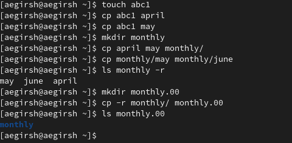
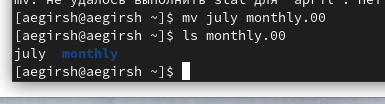
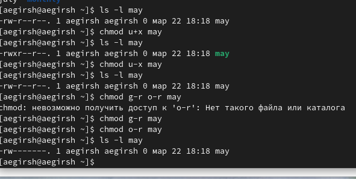
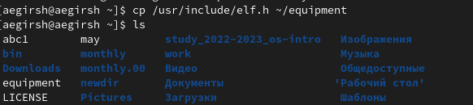
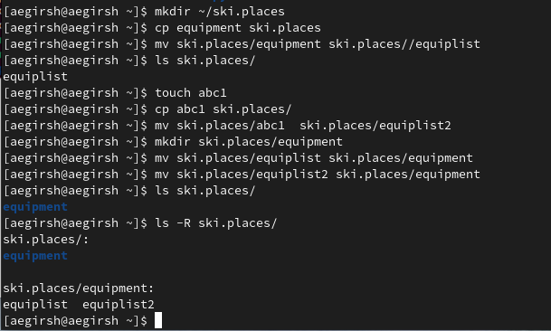
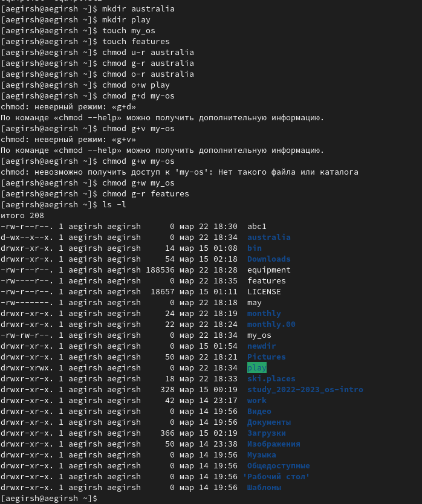
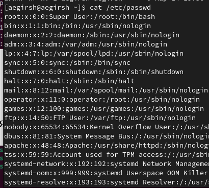
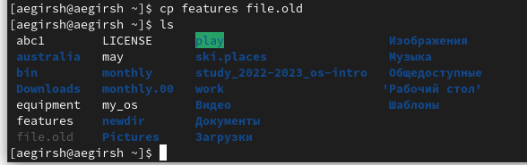
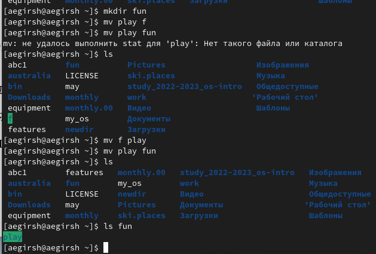

---
## Front matter
title: "Отчет по Лаборраторной работе №7"
author: "Гиршфельд Александр"

## Generic otions
lang: ru-RU
toc-title: "Содержание"

## Bibliography
bibliography: bib/cite.bib
csl: pandoc/csl/gost-r-7-0-5-2008-numeric.csl

## Pdf output format
toc: true # Table of contents
toc-depth: 2
lof: true # List of figures
lot: true # List of tables
fontsize: 12pt
linestretch: 1.5
papersize: a4
documentclass: scrreprt
## I18n polyglossia
polyglossia-lang:
  name: russian
  options:
	- spelling=modern
	- babelshorthands=true
polyglossia-otherlangs:
  name: english
## I18n babel
babel-lang: russian
babel-otherlangs: english
## Fonts
mainfont: PT Serif
romanfont: PT Serif
sansfont: PT Sans
monofont: PT Mono
mainfontoptions: Ligatures=TeX
romanfontoptions: Ligatures=TeX
sansfontoptions: Ligatures=TeX,Scale=MatchLowercase
monofontoptions: Scale=MatchLowercase,Scale=0.9
## Biblatex
biblatex: true
biblio-style: "gost-numeric"
biblatexoptions:
  - parentracker=true
  - backend=biber
  - hyperref=auto
  - language=auto
  - autolang=other*
  - citestyle=gost-numeric
## Pandoc-crossref LaTeX customization
figureTitle: "Рис."
tableTitle: "Таблица"
listingTitle: "Листинг"
lofTitle: "Список иллюстраций"
lotTitle: "Список таблиц"
lolTitle: "Листинги"
## Misc options
indent: true
header-includes:
  - \usepackage{indentfirst}
  - \usepackage{float} # keep figures where there are in the text
  - \floatplacement{figure}{H} # keep figures where there are in the text
---

# Цель работы

Ознакомление с файловой системой Linux, её структурой, именами и содержанием
каталогов. Приобретение практических навыков по применению команд для работы
с файлами и каталогами, по управлению процессами (и работами), по проверке исполь-
зования диска и обслуживанию файловой системы.

# Выполнение лабораторной работы

Выполнил примеры лабораторной работы(рис. @fig:001).

{#fig:001 width=70%}

Переместил и переименовал файлы с помощью mv  (рис. @fig:002)

{#fig:002 width=70%}

Настроил права доступа командой chmod(рис. @fig:003).

{#fig:003 width=70%}

Скопировал файл из /usr/include под именем equipment(рис. @fig:004).

{#fig:004 width=70%}

В домашнем каталоге создал директорию ~/ski.plases. Переместил файл equipment в каталог ~/ski.plases. Переименовал файл ~/ski.plases/equipment в ~/ski.plases/equiplist. Создал в домашнем каталоге файл abc1 и скопировал его в каталог
~/ski.plases, назвал его equiplist.  Создал каталог с именем equipment в каталоге ~/ski.plases. Переместил файлы ~/ski.plases/equiplist и equiplist2 в каталог
~/ski.plases/equipment.(рис. @fig:005).

{#fig:005 width=70%}

Настроил файлам права доступа(рис. @fig:006).

{#fig:006 width=70%}

Файл passwrd(рис. @fig:007).

{#fig:007 width=70%}

Права доступа для features (рис. @fig:008).

{#fig:008 width=70%}

Перемещение каталогов друг в друга(рис. @fig:009).

{#fig:009 width=70%}

5. Прочел man по mount, fsck, mkfs, kill

- mount для подключения дисков
- fsck для восстановления файловой системы
- mkfs для создания файловой системы
- kill для отправки сигнала на процесс

# Ответы на контрольные вопросы

1. Дайте характеристику каждой файловой системе, существующей на жёстком диске
компьютера, на котором вы выполняли лабораторную работу.

	На жестком диске компьютера, на котором я выполняла лабораторную работу, были установлены следующие файловые системы: ext4, swap и vfat. ext4 - это распространенная файловая система для Linux, vfat - файловая система для устройств с файловыми системами FAT32 и FAT16, 
	
2. Приведите общую структуру файловой системы и дайте характеристику каждой директории первого уровня этой структуры.

	Общая структура файловой системы Linux: корневой каталог (/), каталоги исполняемых файлов (/bin), конфигурационные файлы (/etc), домашние каталоги пользователей (/home), временные файлы (/tmp), системные файлы (/sys) и устройства (/dev).

3. Какая операция должна быть выполнена, чтобы содержимое некоторой файловой системы было доступно операционной системе?

	Необходимо произвести монтирование файловой системы.

4. Назовите основные причины нарушения целостности файловой системы. Как устранить повреждения файловой системы?

	Основные причины нарушения целостности файловой системы: сбои в питании, неправильное завершение работы, ошибки в работе программного обеспечения. Повреждения файловой системы могут быть устранены с помощью специализированных инструментов, таких как fsck.

5. Как создаётся файловая система?

	Файловая система создается с помощью утилиты mkfs, которая форматирует блочное устройство, подготавливая его для использования.

6. Дайте характеристику командам для просмотра текстовых файлов.

	Основные команды для просмотра текстовых файлов: cat (вывод содержимого файла в терминал), less (постраничный просмотр содержимого файла), head (вывод первых строк файла), tail (вывод последних строк файла).

7. Приведите основные возможности команды cp в Linux
   
   Основные возможности команды cp в Linux: копирование файлов и директорий, рекурсивное копирование содержимого директории, переименование файлов и директорий, установка разрешений на файлы и директории при копировании.

# Выводы

##  Заключение

Я ознакомился с файловой системыой LInux и ее структурой, именами и содержанием каталогов
