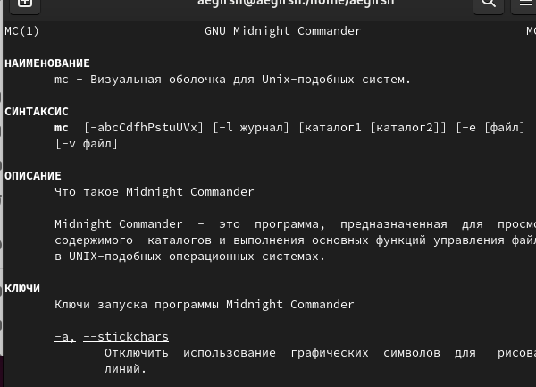
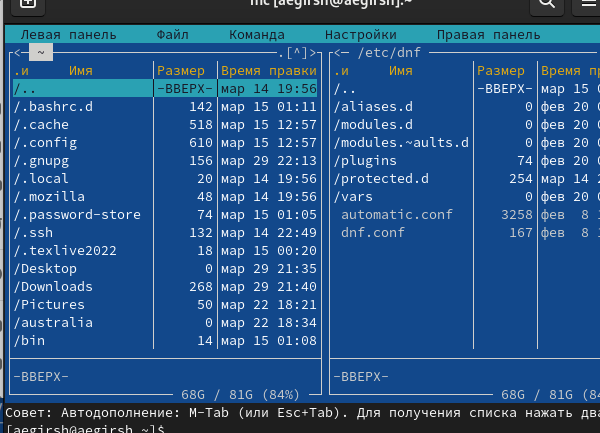
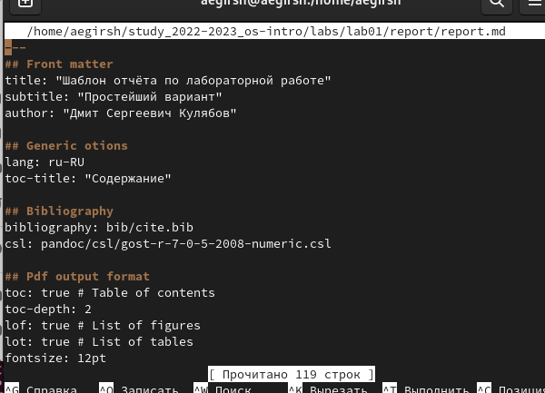
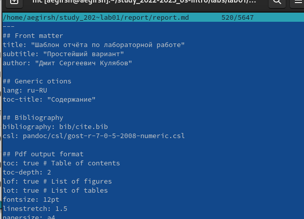
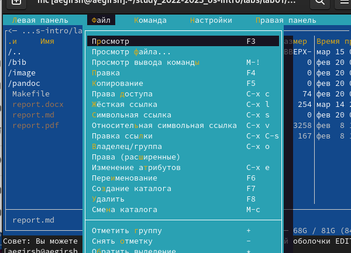
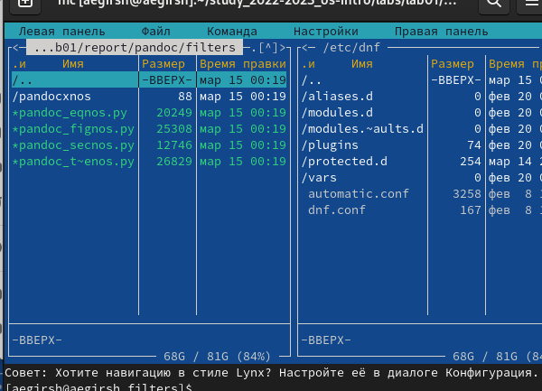

---
## Front matter
lang: ru-RU
title: Л09
subtitle: Простейший шаблон
author:
  - Гиршфельд А. Е.
institute:
  - Российский университет дружбы народов, Москва, Россия
  
## i18n babel
babel-lang: russian
babel-otherlangs: english

## Formatting pdf
toc: false
toc-title: Содержание
slide_level: 2
aspectratio: 169
section-titles: true
theme: metropolis
header-includes:
 - \metroset{progressbar=frametitle,sectionpage=progressbar,numbering=fraction}
 - '\makeatletter'
 - '\beamer@ignorenonframefalse'
 - '\makeatother'
---

## Информация

## Цель работы

Освоение основных возможностей командной оболочки Midnight Commander. Приобретение навыков практической работы по просмотру каталогов и файлов, манипуляций с ними.

##  Посмотрел man для команды mc

## Запустил mc

## Открыл текстовый файл в редакторе mc.

## Открыл через встроенный в mc media viewer

## Изучил меню file

## Перемещусь по каталогам с помощью mc

# Выводы

Освоил основные возможности командной оболочки Midnight Commander. Приобрел навыки практической работы по просмотру каталогов и файлов, манипуляций с ними.
Ответы на контрольные вопросы
